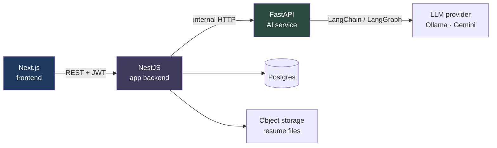

# Fitmark

Upload your resume, paste a job description, and get a fit score, a skill-gap breakdown, a tailored cover letter, and an interview prep pack — then track every application on a Kanban board, from applied through each interview round to the offer.

Every AI output is a **draft you approve**. Nothing is ever marked approved, auto-sent, or auto-applied without an explicit click — most "AI job tools" apply on your behalf or silently rewrite your resume; this one keeps a human in the loop at every step.

**Live:** [fitmark.rahuls.dev](https://fitmark.rahuls.dev)

---

## Features

| | |
|---|---|
| **Resume ingestion** | Upload a PDF/DOCX → text extraction → LLM parses it into structured data → you correct what it got wrong → save as your base resume. Correcting the parse changes what the AI reads, never the original file |
| **Fit analysis** | Scores your resume against a job description, listing matched skills, missing skills, and concrete suggestions |
| **Cover letters** | Three tone presets, fully editable, saved as a draft until you explicitly approve it |
| **Interview prep** | Study topics derived from the job, plus questions an interviewer would ask about *your* projects — grounded only in the resume, never inferred from the job ad |
| **Interview rounds** | Schedule each round, then record what happened: questions asked, your own feedback, the result, whether a follow-up is due |
| **Application tracker** | Kanban board (Applied → Interview → Offer → Rejected), drag-to-persist, notes, fields that change with the stage |
| **Dashboard** | Application stats, average fit score, stale-application reminders |

## Architecture

Three services, one-directional dependency: frontend → backend → AI service.



The frontend talks only to NestJS. NestJS owns the database and is the only caller of the AI service. FastAPI is **stateless** — no database access; every request carries everything it needs. All AI calls funnel through a single `OrchestrationService`, so timeouts, retries, and error translation are written once.

## How the AI parts work

- **Structured output, not JSON parsing** — every LLM call binds a Pydantic schema via LangChain's `with_structured_output()`, so the model is constrained to a valid shape instead of emitting JSON that needs repair.
- **Provider-agnostic** — `app/core/llm.py` is the only file that imports a model class, lazily, inside the branch that needs it. Switching Ollama ↔ Gemini is one env var — built locally against a free local model, deployed against a hosted one.
- **Human-in-the-loop** — a cover letter is stored with `coverLetterApproved: false`; only an explicit click flips it.
- **Files by signed URL, not raw bytes** — NestJS uploads to private storage and hands FastAPI a short-lived signed URL, so the AI service never holds storage credentials.
- **Quota-spending routes are rate limited per user**, not per IP — behind a reverse proxy every request shares one address.

## Tech stack

**Frontend** — Next.js 16 (App Router), TypeScript, Tailwind v4, shadcn/ui on Base UI, dnd-kit, Clerk
**Backend** — NestJS 11, Prisma 6, PostgreSQL, Clerk JWT verification, Supabase Storage
**AI service** — FastAPI, LangChain, LangGraph, pypdf, python-docx — Ollama locally, Gemini in production, selected by one env var

## Running it locally

**Prerequisites:** Node 22, Python 3.12, a PostgreSQL database, and one LLM provider — [Ollama](https://ollama.com) (free, local) or a Gemini API key.

```bash
git clone https://github.com/sutharrahul/agentic-job-assistant.git
cd agentic-job-assistant
```

**1. AI service** (port 8000)

```bash
cd ai-service
python -m venv venv && source venv/bin/activate
pip install -r requirements.txt
cp .env.example .env          # defaults to local Ollama
ollama pull gemma3:4b         # only if using Ollama
uvicorn app.main:app --port 8000
```

**2. Backend** (port 3001)

```bash
cd backend
npm install
cp .env.example .env          # fill in DATABASE_URL, Clerk and Supabase keys
npx prisma generate           # required — backend/generated/ is gitignored
npx prisma migrate deploy
npm run start:dev
```

**3. Frontend** (port 3000)

```bash
cd frontend
npm install
cp .env.example .env.local    # fill in Clerk keys and NEXT_PUBLIC_API_URL
npm run dev
```

### Environment variables

**`backend/.env`**

| Variable | Purpose |
|---|---|
| `DATABASE_URL` | PostgreSQL connection string |
| `AI_SERVICE_URL` | Base URL of the FastAPI service |
| `FRONTEND_URL` | Allowed CORS origin — the app refuses to boot without it |
| `CLERK_SECRET_KEY`, `CLERK_WEBHOOK_SIGNING_SECRET` | Session verification and user-provisioning webhook |
| `SUPABASE_URL`, `SUPABASE_SERVICE_ROLE_KEY` | Resume file storage |
| `AI_SERVICE_TOKEN` | Optional locally, required in deployment — shared secret sent to the AI service |

**`ai-service/.env`**

| Variable | Purpose |
|---|---|
| `LLM_PROVIDER` | `ollama` or `gemini` |
| `GEMINI_API_KEY`, `GEMINI_CHAT_MODEL` | Required when provider is `gemini` |
| `OLLAMA_BASE_URL`, `OLLAMA_CHAT_MODEL` | Used when provider is `ollama` |
| `SERVICE_TOKEN` | Optional locally, required in deployment — must match the backend's `AI_SERVICE_TOKEN` |

**`frontend/.env.local`**

| Variable | Purpose |
|---|---|
| `NEXT_PUBLIC_API_URL` | Base URL of the NestJS backend |
| `NEXT_PUBLIC_CLERK_PUBLISHABLE_KEY`, `CLERK_SECRET_KEY` | Clerk keys |
| `NEXT_PUBLIC_CLERK_SIGN_IN_URL` / `..._SIGN_UP_URL` | `/login` and `/signup` |
| `NEXT_PUBLIC_CLERK_SIGN_IN_FALLBACK_REDIRECT_URL` / `..._SIGN_UP_...` | `/dashboard` for a returning user, `/resume` for a new one |

## Project structure

```
frontend/     Next.js App Router UI
  src/app/          routes (landing, auth, dashboard, resume, applications)
  src/components/   feature + ui components
  src/lib/          api clients, axios instance, types

backend/      NestJS — owns the database, calls the AI service
  src/resumes/        upload → storage → parse → confirm
  src/applications/   CRUD + the three AI actions
  src/orchestration/  the single choke point for all AI calls
  prisma/             schema + migrations

ai-service/   FastAPI — stateless AI, no database
  app/routers/    one file per endpoint
  app/services/   text extraction, resume extraction
  app/graph/      the one LangGraph workflow (interview prep)
  app/core/       LLM provider selection, settings
```

## Deployment

`render.yaml` at the repo root is a Render Blueprint describing both backend services; the frontend is on Vercel, which detects Next.js from `frontend/package.json`.

| Service | Host |
|---|---|
| Next.js frontend | Vercel |
| NestJS backend | Render (free) |
| FastAPI AI service | Render (free) |
| Postgres + file storage | Supabase (free) |

Worth knowing if you fork this:

- **Use Supabase's session pooler string** (port 5432), not the direct connection (IPv6-only) or the transaction pooler on 6543 (can't run `prisma migrate deploy`).
- **`FRONTEND_URL` and `AI_SERVICE_URL` take no trailing slash** — CORS compares the origin as an exact string.
- **`NEXT_PUBLIC_*` values are inlined at build time** — changing one in the Vercel dashboard does nothing until redeployed.
- **Free-tier services sleep after ~15 minutes idle** — the first request after a quiet period can take 30–40s while the instance wakes. Both services expose an unauthenticated `/health` so an external scheduler can keep them warm; the frontend also pings the AI service proactively the moment an authenticated page loads, so it's usually already warming by the time you'd need it.

## Trade-offs and known limits

- **Resume parsing is synchronous inside the upload request** — no queue or worker. A thrown error is caught and the row marked `FAILED`; a process dying mid-parse (deploy, OOM, free-tier sleep) is not — the row stays stuck in `PROCESSING`.
- **DOCX extraction reads paragraphs only** — text in tables, headers, and text boxes is missed. Scanned/image-only PDFs are rejected rather than OCR'd.
- **Rate-limit counters live in memory** — reset on restart, not shared across instances.
- **The AI service is protected by a shared secret, not network isolation** — the free tier offers public URLs only, so it gets an `X-Service-Token` check instead of a private network.
- **Test coverage is deliberately narrow** — four backend suites cover the logic where a bug would be silent and expensive (AI-call error translation, the user-provisioning upsert, per-user scoping, and IDOR-proofing on signed resume-file URLs). No frontend or end-to-end tests; the AI service has none, since its behavior depends on a live model.

## License

MIT
