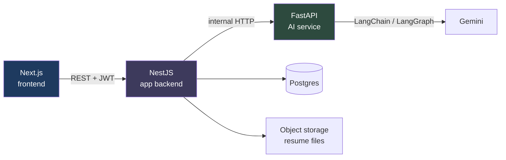

# Agentic Job Assistant

Upload your resume, paste a job description, and get a fit score, a skill-gap breakdown, a tailored cover letter, and an interview prep pack — then track every application on a Kanban board.

Every AI output is a **draft you approve**. Nothing is auto-applied and nothing is saved to your profile without an explicit click.

<!-- TODO(after deploy): replace with the live URL and a demo GIF -->
**Live demo:** _coming soon_ · **Demo video:** _coming soon_

---

## Why this project exists

Most "AI job tools" either apply on your behalf or silently rewrite your resume. Both are the wrong trade: you lose control of what a recruiter sees. This one keeps a human in the loop at every step — the AI drafts, you edit and approve.

It's also a deliberate exercise in service boundaries: a TypeScript app backend and a Python AI service that never touch each other's concerns.

## Features

| | |
|---|---|
| **Resume ingestion** | Upload a PDF/DOCX → text extraction → LLM parses it into structured data → you edit it → save as your base resume |
| **Fit analysis** | Scores your resume against a job description, listing matched skills, missing skills, and concrete suggestions |
| **Cover letters** | Three tone presets (Formal / Conversational / Concise), fully editable, saved only when you approve |
| **Interview prep** | A LangGraph workflow that derives focus areas, then generates technical and behavioural questions with talking points drawn from *your* resume |
| **Application tracker** | Kanban board (Applied → Interview → Offer → Rejected) with drag-to-persist, notes, and stage-specific fields |
| **Dashboard** | Application stats, average fit score, and stale-application reminders |

## Architecture

Three services with a strict, one-directional dependency rule.



**The rule:** the frontend talks only to NestJS. NestJS owns the database and is the only caller of the AI service. FastAPI is **stateless** — it has no database access at all; every request carries everything it needs, and it returns JSON.

**Why:** it keeps one source of truth for persistence and authorization, and makes the AI service independently testable and replaceable. The split is simply: *touches the LLM* → FastAPI; *touches data or users* → NestJS.

All AI calls funnel through a single `OrchestrationService`, so timeouts, retries, and error translation are written once rather than per feature.

## How the AI parts work

- **Structured output, not JSON parsing.** Resume parsing, fit analysis, and interview prep bind a Pydantic schema with LangChain's `with_structured_output()`, so the model is constrained to a valid shape instead of being asked to emit JSON that then needs parsing and repair.
- **Temperature is chosen per task.** Fit scoring runs at `temperature=0` — the same resume against the same job should produce the same score. Cover letters run at `0.7`, because "Regenerate" should give a genuinely different draft.
- **Provider-agnostic by design.** `app/core/llm.py` is the only file that imports a model class. Switching between local Ollama and Gemini is one env var, which is how this was developed locally for free and deployed on Gemini.
- **Human-in-the-loop.** The AI service returns a cover letter *draft*. NestJS stores it with `coverLetterApproved: false`, and only an explicit user click flips that flag.
- **Files are passed by signed URL.** NestJS uploads the resume to private storage and hands FastAPI a short-lived signed URL rather than the raw bytes, so the AI service never needs storage credentials.

## Tech stack

**Frontend** — Next.js 16 (App Router), TypeScript, Tailwind v4, shadcn/ui on Base UI, dnd-kit, axios, Clerk
**Backend** — NestJS 11, Prisma 6, PostgreSQL, Clerk JWT verification, Supabase Storage
**AI service** — FastAPI, LangChain, LangGraph, Google Gemini (Ollama for local dev), pypdf, python-docx

## Running it locally

**Prerequisites:** Node 20+, Python 3.11+, a PostgreSQL database, and either [Ollama](https://ollama.com) (free, local) or a Gemini API key.

```bash
git clone https://github.com/sutharrahul/agentic-job-assistant.git
cd agentic-job-assistant
```

**1. AI service** (port 8000)

```bash
cd ai-service
python -m venv venv && source venv/bin/activate
pip install -r requirements.txt
cp .env.example .env          # defaults to local Ollama
ollama pull gemma3:4b         # only if using Ollama
uvicorn app.main:app --port 8000
```

**2. Backend** (port 3001)

```bash
cd backend
npm install
cp .env.example .env          # fill in DATABASE_URL, Clerk and Supabase keys
npx prisma migrate deploy
npm run start:dev
```

**3. Frontend** (port 3000)

```bash
cd frontend
npm install
cp .env.example .env.local    # fill in Clerk keys and NEXT_PUBLIC_API_URL
npm run dev
```

### Environment variables

**`backend/.env`**

| Variable | Purpose |
|---|---|
| `DATABASE_URL` | PostgreSQL connection string |
| `AI_SERVICE_URL` | Base URL of the FastAPI service |
| `FRONTEND_URL` | Allowed CORS origin — the app refuses to boot without it |
| `CLERK_SECRET_KEY` | Verifies incoming session JWTs |
| `CLERK_WEBHOOK_SIGNING_SECRET` | Verifies the `user.created` webhook |
| `SUPABASE_URL`, `SUPABASE_SERVICE_ROLE_KEY` | Resume file storage |
| `SUPABASE_STORAGE_BUCKET` | Bucket name (default `resumes`) |

**`ai-service/.env`**

| Variable | Purpose |
|---|---|
| `LLM_PROVIDER` | `ollama` or `gemini` |
| `GEMINI_API_KEY` | Required when provider is `gemini` |
| `GEMINI_CHAT_MODEL` | Optional — pin the model id |
| `OLLAMA_BASE_URL`, `OLLAMA_CHAT_MODEL` | Used when provider is `ollama` |

**`frontend/.env.local`**

| Variable | Purpose |
|---|---|
| `NEXT_PUBLIC_API_URL` | Base URL of the NestJS backend |
| `NEXT_PUBLIC_CLERK_PUBLISHABLE_KEY` | Clerk client key |
| `CLERK_SECRET_KEY` | Used by Clerk's Next.js middleware |

## Project structure

```
frontend/     Next.js App Router UI
  src/app/          routes (landing, auth, dashboard, resume, applications)
  src/components/   feature + ui components
  src/lib/          api clients, axios instance, types

backend/      NestJS — owns the database, calls the AI service
  src/resumes/        upload → storage → parse → confirm
  src/applications/   CRUD + the three AI actions
  src/orchestration/  the single choke point for all AI calls
  prisma/             schema + migrations

ai-service/   FastAPI — stateless AI, no database
  app/routers/    one file per endpoint
  app/services/   text extraction, resume extraction
  app/graph/      LangGraph workflows
  app/core/       LLM provider selection, settings
```

## Trade-offs and known limits

Being explicit about what this does *not* do:

- **Cover-letter approval is a database flag, not a LangGraph `interrupt`.** A durable interrupt would need checkpointer-backed state; a boolean gives the same user-facing guarantee for this scope.
- **Resume parsing is synchronous inside the upload request.** No queue or worker — fine at this scale, but a crash mid-parse leaves a row stuck in `PROCESSING`.
- **DOCX extraction reads paragraphs only,** so text inside tables, headers, and text boxes is missed. Scanned/image-only PDFs are rejected rather than OCR'd.
- **No fit-analysis caching yet.** Scoring the same resume against the same job re-runs the model.
- **No automated tests.** The scaffolding tests that shipped with NestJS were removed rather than left as fake coverage.

## License

MIT
