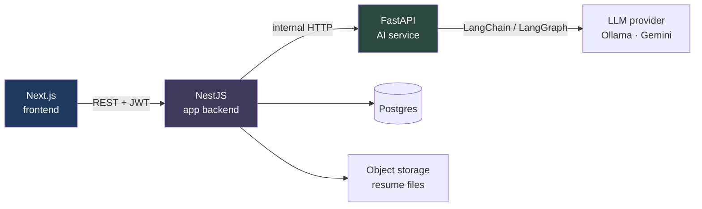

# Fitmark

Upload your resume, paste a job description, and get a fit score, a skill-gap breakdown, a tailored cover letter, and an interview prep pack — then track every application on a Kanban board, from applied through each interview round to the offer.

Every AI output is a **draft you approve**. Drafts are stored as soon as they're generated — so you don't lose work on a refresh — but nothing is ever marked approved, auto-sent, or auto-applied without an explicit click.

<!-- TODO(after deploy): replace with the live URL and a demo GIF -->
**Live demo:** _coming soon_ · **Demo video:** _coming soon_

---

## Why this project exists

Most "AI job tools" either apply on your behalf or silently rewrite your resume. Both are the wrong trade: you lose control of what a recruiter sees. This one keeps a human in the loop at every step — the AI drafts, you edit and approve.

It's also a deliberate exercise in service boundaries: a TypeScript app backend and a Python AI service that never touch each other's concerns.

## Features

| | |
|---|---|
| **Resume ingestion** | Upload a PDF/DOCX → text extraction → LLM parses it into structured data → you correct what it got wrong → save as your base resume. The original file stays downloadable; correcting the parse changes what the AI reads, never the file itself |
| **Fit analysis** | Scores your resume against a job description, listing matched skills, missing skills, and concrete suggestions |
| **Cover letters** | Three tone presets (Formal / Conversational / Concise), fully editable; the draft is saved the moment it's generated but stays flagged unapproved until you approve it |
| **Interview prep** | A two-branch LangGraph workflow: study topics derived from the job, plus questions an interviewer would ask about *your* projects — grounded only in the resume, never inferred from the job ad. Generated once per application and kept, so changing stage never spends quota re-deriving it |
| **Interview rounds** | Schedule each round, then record what actually happened: the questions you were asked, your own feedback, the result, and whether a follow-up is due. Countdown badges on the board, next-interview card on the dashboard |
| **Application tracker** | Kanban board (Applied → Interview → Offer → Rejected) with drag-to-persist, an add/delete notes list, and fields that change with the stage — offer details on OFFER, rejection reason on REJECTED |
| **Dashboard** | Application stats, average fit score, and stale-application reminders |

## Architecture

Three services with a strict, one-directional dependency rule.



**The rule:** the frontend talks only to NestJS. NestJS owns the database and is the only caller of the AI service. FastAPI is **stateless** — it has no database access at all; every request carries everything it needs, and it returns JSON.

**Why:** it keeps one source of truth for persistence and authorization, and makes the AI service independently testable and replaceable. The split is simply: *touches the LLM* → FastAPI; *touches data or users* → NestJS.

All AI calls funnel through a single `OrchestrationService`, so timeouts, retries, and error translation are written once rather than per feature.

## How the AI parts work

- **Structured output, not JSON parsing.** Resume parsing, fit analysis, and interview prep bind a Pydantic schema with LangChain's `with_structured_output()`, so the model is constrained to a valid shape instead of being asked to emit JSON that then needs parsing and repair.
- **Temperature is chosen per task.** Fit scoring runs at `temperature=0` — the same resume against the same job should produce the same score. Cover letters run at `0.7`, because "Regenerate" should give a genuinely different draft.
- **Provider-agnostic by design.** `app/core/llm.py` is the only file that imports a model class, and it imports each provider lazily inside the branch that needs it — so a deployment loads one SDK, not two. Switching between Ollama and Gemini is one env var, which is how the whole thing was built locally against a free local model and deployed against a hosted one.
- **Human-in-the-loop.** The AI service returns a cover letter *draft*. NestJS stores it with `coverLetterApproved: false`, and only an explicit user click flips that flag.
- **Files are passed by signed URL.** NestJS uploads the resume to private storage and hands FastAPI a short-lived signed URL rather than the raw bytes, so the AI service never needs storage credentials.
- **Quota-spending routes are rate limited per user.** The AI actions and resume upload are capped on two windows (per-minute and per-day), keyed on the authenticated user rather than IP — behind a reverse proxy every request shares one address, so IP-based limits would throttle all users as a single bucket.

## Tech stack

**Frontend** — Next.js 16 (App Router), TypeScript, Tailwind v4, shadcn/ui on Base UI, dnd-kit, axios, Clerk
**Backend** — NestJS 11, Prisma 6, PostgreSQL, Clerk JWT verification, Supabase Storage
**AI service** — FastAPI, LangChain, LangGraph, pypdf, python-docx; two interchangeable LLM providers selected by one env var (Ollama for local dev, Gemini in deployment)

## Running it locally

**Prerequisites:** Node 22 (both `package.json` files pin `"engines": { "node": "22.x" }`, and Render is pinned to the same), Python 3.11+, a PostgreSQL database, and one LLM provider — [Ollama](https://ollama.com) (free, local), or a Gemini API key.

```bash
git clone https://github.com/sutharrahul/agentic-job-assistant.git
cd agentic-job-assistant
```

**1. AI service** (port 8000)

```bash
cd ai-service
python -m venv venv && source venv/bin/activate
pip install -r requirements.txt
cp .env.example .env          # defaults to local Ollama
ollama pull gemma3:4b         # only if using Ollama
uvicorn app.main:app --port 8000
```

**2. Backend** (port 3001)

```bash
cd backend
npm install
cp .env.example .env          # fill in DATABASE_URL, Clerk and Supabase keys
npx prisma generate           # required: backend/generated/ is gitignored
npx prisma migrate deploy
npm run start:dev
```

`prisma generate` is not optional and `migrate deploy` does not do it for you. `backend/generated/` is gitignored and there's no `postinstall` hook, so on a fresh clone the Prisma client doesn't exist and the build fails at the first import.

**3. Frontend** (port 3000)

```bash
cd frontend
npm install
cp .env.example .env.local    # fill in Clerk keys and NEXT_PUBLIC_API_URL
npm run dev
```

### Environment variables

**`backend/.env`**

| Variable | Purpose |
|---|---|
| `PORT` | Port the server listens on (defaults to `3001` if unset) |
| `DATABASE_URL` | PostgreSQL connection string |
| `AI_SERVICE_URL` | Base URL of the FastAPI service |
| `FRONTEND_URL` | Allowed CORS origin — the app refuses to boot without it |
| `CLERK_SECRET_KEY` | Verifies incoming session JWTs |
| `CLERK_WEBHOOK_SIGNING_SECRET` | Verifies the `user.created` webhook |
| `SUPABASE_URL`, `SUPABASE_SERVICE_ROLE_KEY` | Resume file storage |
| `SUPABASE_STORAGE_BUCKET` | Bucket name (default `resumes`) |
| `AI_SERVICE_TOKEN` | Optional locally, required in deployment — shared secret sent to the AI service |

**`ai-service/.env`**

| Variable | Purpose |
|---|---|
| `LLM_PROVIDER` | `ollama` or `gemini` |
| `GEMINI_API_KEY` | Required when provider is `gemini` |
| `GEMINI_CHAT_MODEL` | Optional — pin the model id (defaults to `gemini-3.5-flash-lite`, the lightest tier, picked for its higher free-tier request quota) |
| `OLLAMA_BASE_URL`, `OLLAMA_CHAT_MODEL` | Used when provider is `ollama` |
| `SERVICE_TOKEN` | Optional locally, required in deployment — must match the backend's `AI_SERVICE_TOKEN` |

**`frontend/.env.local`**

| Variable | Purpose |
|---|---|
| `NEXT_PUBLIC_API_URL` | Base URL of the NestJS backend |
| `NEXT_PUBLIC_CLERK_PUBLISHABLE_KEY` | Clerk client key |
| `CLERK_SECRET_KEY` | Used by `clerkMiddleware()` in `frontend/src/proxy.ts` — Next 16 renamed the `middleware` file convention to `proxy`, so there is no `middleware.ts` |
| `NEXT_PUBLIC_CLERK_SIGN_IN_URL` / `..._SIGN_UP_URL` | `/login` and `/signup` — this app doesn't use Clerk's default paths |
| `NEXT_PUBLIC_CLERK_SIGN_IN_FALLBACK_REDIRECT_URL` / `..._SIGN_UP_...` | Where to land after authenticating — `/dashboard` for a returning user, `/resume` for a new one, who has nothing for the dashboard to show yet |

## Project structure

```
frontend/     Next.js App Router UI
  src/app/          routes (landing, auth, dashboard, resume, applications)
  src/components/   feature + ui components
  src/lib/          api clients, axios instance, types

backend/      NestJS — owns the database, calls the AI service
  src/resumes/        upload → storage → parse → confirm
  src/applications/   CRUD + the three AI actions
  src/orchestration/  the single choke point for all AI calls
  prisma/             schema + migrations

ai-service/   FastAPI — stateless AI, no database
  app/routers/    one file per endpoint
  app/services/   text extraction, resume extraction
  app/graph/      the one LangGraph workflow (interview prep)
  app/core/       LLM provider selection, settings
```

## Deployment

`render.yaml` at the repo root is a Render Blueprint describing both backend services; the frontend goes to Vercel, which detects Next.js from `frontend/package.json` and needs no config.

| Service | Host | Notes |
|---|---|---|
| Next.js frontend | Vercel | Root Directory must be set to `frontend` |
| NestJS backend | Render (free) | `job-assistant-api` in the blueprint |
| FastAPI AI service | Render (free) | `job-assistant-ai` in the blueprint |
| Postgres + file storage | Supabase (free) | Storage bucket is created automatically on boot |

Four things that are easy to get wrong, all of which cost an hour each to diagnose:

- **Use Supabase's session pooler string** (port 5432) for `DATABASE_URL`. The direct connection is IPv6-only and Render cannot reach it; the transaction pooler on 6543 can't run `prisma migrate deploy`.
- **`npx prisma generate` has to be in the build command.** `backend/generated/` is gitignored, so the client doesn't exist in a fresh checkout.
- **`FRONTEND_URL` and `AI_SERVICE_URL` take no trailing slash.** CORS compares the origin as an exact string, and the AI path is concatenated onto its base URL.
- **`NEXT_PUBLIC_*` values are inlined at build time.** Changing one in the Vercel dashboard does nothing until you redeploy.

Because CORS allows exactly one origin, Vercel *preview* deployments are blocked by design — only the production URL can talk to the backend.

## Trade-offs and known limits

Being explicit about what this does *not* do:

- **Cover-letter approval is a database flag, not a LangGraph `interrupt`.** A durable interrupt would need checkpointer-backed state; a boolean gives the same user-facing guarantee for this scope.
- **Resume parsing is synchronous inside the upload request.** No queue or worker — fine at this scale. A *thrown* error is handled: `resumes.service.ts` catches it and marks the row `FAILED`. What isn't handled is the process dying mid-parse (deploy, OOM, free-tier sleep), which leaves the row stuck in `PROCESSING` with nothing to reset it.
- **DOCX extraction reads paragraphs only,** so text inside tables, headers, and text boxes is missed. Scanned/image-only PDFs are rejected rather than OCR'd.
- **Fit results are cached per application, not across applications.** A score is written to the application row, so revisiting one never re-runs the model — but pasting the same job description into two applications scores it twice.
- **Rate-limit counters live in memory,** so they reset on restart and aren't shared across instances. Accurate enforcement across several instances would need a shared store.
- **The AI service is protected by a shared secret, not by network isolation.** The architecture assumes it is unreachable from the internet, which is what a private network would give it — but the free tier offers web services only, so it gets a public URL and a `X-Service-Token` check instead. Same guarantee at this scale, less elegant.
- **Free-tier instances sleep after ~15 minutes idle,** so the first request after a quiet period can take around 50 seconds while the service wakes. Both services expose an unauthenticated `/health` precisely so an external scheduler can ping them and keep them warm — but that's a setup step you'd do outside this repo (an uptime monitor or a cron elsewhere). **This repo ships no scheduler,** so as things stand the first page load after a quiet period is slow.
- **Test coverage is deliberately narrow.** Three backend suites cover the logic where a bug would be silent and expensive: the AI-call error translation, the user-provisioning upsert rule that once corrupted stored emails, and per-user scoping on every application query. There are no frontend or end-to-end tests, and the AI service has none — its behaviour depends on a live model, which is an integration concern rather than a unit one.

## License

MIT
